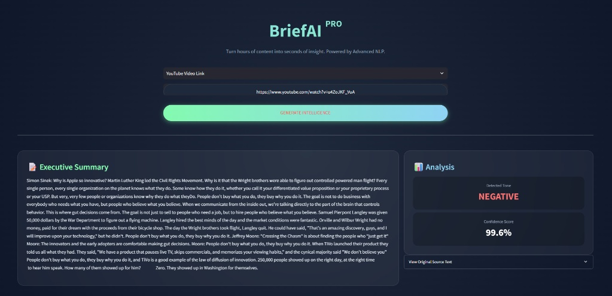
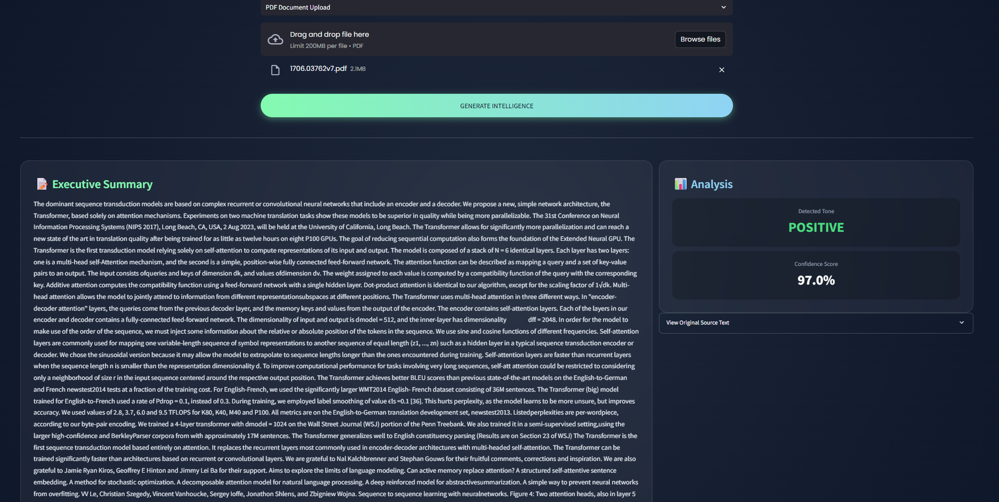

# ⚡ BriefAI: Next-Gen Content Intelligence Platform


> **Turn hours of video content and long documents into seconds of actionable insights.**

**BriefAI** is an advanced NLP application designed to process, summarize, and analyze unstructured data from **YouTube videos** and **PDF documents**. It leverages State-of-the-Art (SOTA) Large Language Models (LLMs) to provide executive summaries, sentiment intelligence, and restored readable text from raw streams.

---

## Dashboard Demo

The application seamlessly switches between video stream analysis and document parsing modes.

| 🎥 Video Intelligence (YouTube) | 📄 Document Intelligence (PDF) |
| :---: | :---: |
|  |  |
| *Sentiment & Abstractive Summary of Simon Sinek's Speech* | *Technical Analysis of "Attention Is All You Need" Paper* |

---

## Key Features

### 1. Multi-Modal Input Support
* **YouTube Integration:** Automatically extracts transcripts using the `youtube-transcript-api`. Handles auto-generated captions and multiple language fallbacks.
* **PDF Analysis:** Parses text from uploaded PDF documents using `pypdf` for quick document review.

### 2. Intelligent Summarization Pipeline
* **Model:** Powered by **Facebook's BART (Large-CNN)**.
* **Smart Chunking Algorithm:** Implements a fault-tolerant logic that splits long content into 2000-character segments. This bypasses the 1024-token limit of standard transformers, preventing crashes on long videos (e.g., 1-hour lectures).

### 3. Sentiment & Tone Analysis
* **Model:** Powered by **DistilBERT** (SST-2).
* **Insight:** Analyzes the generated summary to determine the dominant emotional tone (Positive/Negative) and provides a confidence score.

### 4. Deep Punctuation Restoration
* **Problem:** Raw YouTube transcripts often lack punctuation, making them hard to read.
* **Solution:** Integrated a Deep Learning model (`deepmultilingualpunctuation`) to automatically restore periods, commas, and capitalization, turning raw streams into grammatically correct text.

### 5. Enterprise-Grade UI/UX
* **Custom CSS:** Overrides standard Streamlit styles with Google Fonts (Poppins), Glassmorphism cards, and gradient buttons.
* **Interactive Elements:** Tabbed interfaces, status indicators, and one-click report downloading.

---

## Technical Architecture

The project follows a modular **ETL (Extract, Transform, Load)** pattern:

1.  **Extract:** Data is fetched from YouTube API or PDF binary streams.
2.  **Pre-process:**
    * **Normalization:** Text is cleaned.
    * **Punctuation Restoration:** (Optional) Applied via a BERT-based token classification model.
    * **Chunking:** Text is sliced into safe windows to fit GPU/CPU memory.
3.  **Transform (AI Core):**
    * **Summarization:** Each chunk is summarized independently.
    * **Synthesis:** Mini-summaries are combined.
    * **Sentiment:** The final output is scored for polarity.
4.  **Load (UI):** Results are rendered in a high-performance Streamlit frontend.

---

## Installation & Usage

### Prerequisites
* Python 3.10 or higher
* pip

### 1. Clone the Repository
```bash
git clone https://github.com/sevvallaydogann/BriefAI.git
cd BriefAI
```

## 2. Install Dependencies
```bash
pip install -r requirements.txt
```

## 3. Run the Application
```bash
streamlit run app.py
```

